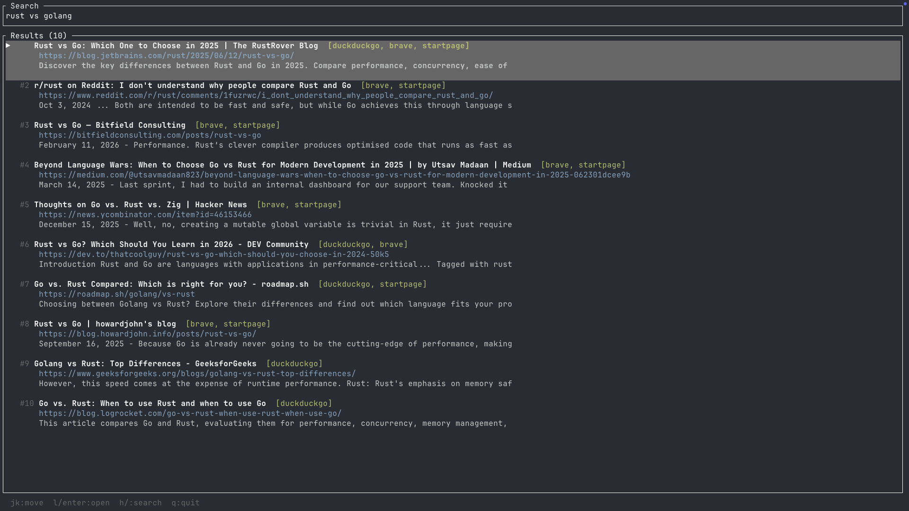

# metadata-search-engine-rs

A SearXNG-style metadata search engine written in Rust. Fans out queries to multiple search engines concurrently, scrapes their HTML results, deduplicates by normalized URL, and ranks using Reciprocal Rank Fusion (RRF).

## How it works

1. A search request arrives at `GET /search?q=<query>`
2. The query is sent concurrently to DuckDuckGo, Brave, Startpage, and Yahoo via `reqwest`
3. Each engine parses the HTML response with `scraper` (CSS selectors over Mozilla's html5ever)
4. Results are deduplicated by normalized URL (tracking params stripped, locale prefixes removed, query params sorted)
5. Duplicate URLs are merged and scored with RRF (`score = Σ 1/(60 + rank)` across engines) — pages returned by multiple engines rank higher
6. The top results are returned as JSON

## Requirements

- Rust 1.75+
- Cargo

## Installation

### As a library

```bash
cargo add metadata-search-engine-rs
```

Or add manually to `Cargo.toml`:

```toml
[dependencies]
metadata-search-engine-rs = "0.1"
```

### As a server (from source)

```bash
git clone https://github.com/MikeLuu99/searxng-rust
cd metadata-search-engine-rs
cargo build --release
```

## Running

```bash
cargo run
```

```bash
PORT=8080 MAX_RESULTS=20 cargo run --release
```

Enable debug logging:

```bash
RUST_LOG=debug cargo run
```

## Examples

Add to your `Cargo.toml`:

```toml
[dependencies]
metadata-search-engine-rs = "0.1"
tokio = { version = "1", features = ["full"] }
```

### Query a single engine

```rust
use std::sync::Arc;
use metadata_search_engine_rs::engines::{DuckDuckGoEngine, SearchEngine, build_http_client};

#[tokio::main]
async fn main() -> anyhow::Result<()> {
    let client = Arc::new(build_http_client()?);
    let engine = DuckDuckGoEngine { client };

    let results = engine.search("rust programming", 5).await?;
    for r in results {
        println!("{}\n  {}", r.title, r.url);
    }
    Ok(())
}
```

### Fan out to all engines and get RRF-ranked results

```rust
use std::sync::Arc;
use metadata_search_engine_rs::{
    aggregator::{aggregate, query_all_engines},
    engines::{BraveEngine, DuckDuckGoEngine, SearchEngine, StartpageEngine, YahooEngine, build_http_client},
};

#[tokio::main]
async fn main() -> anyhow::Result<()> {
    let client = Arc::new(build_http_client()?);
    let engines: Vec<Arc<dyn SearchEngine>> = vec![
        Arc::new(DuckDuckGoEngine { client: Arc::clone(&client) }),
        Arc::new(BraveEngine     { client: Arc::clone(&client) }),
        Arc::new(StartpageEngine { client: Arc::clone(&client) }),
        Arc::new(YahooEngine     { client: Arc::clone(&client) }),
    ];

    let (successes, failures) = query_all_engines(&engines, "rust programming", 10).await;
    for (name, err) in &failures {
        eprintln!("engine {name} failed: {err}");
    }

    let results = aggregate(successes, 10);
    for r in &results {
        println!("[{:.3}] ({}) {}", r.score, r.engines.join(", "), r.title);
        println!("        {}", r.url);
    }
    Ok(())
}
```

### Use only specific engines

```rust
use std::sync::Arc;
use metadata_search_engine_rs::{
    aggregator::{aggregate, query_all_engines},
    engines::{BraveEngine, DuckDuckGoEngine, SearchEngine, build_http_client},
};

#[tokio::main]
async fn main() -> anyhow::Result<()> {
    let client = Arc::new(build_http_client()?);
    let engines: Vec<Arc<dyn SearchEngine>> = vec![
        Arc::new(DuckDuckGoEngine { client: Arc::clone(&client) }),
        Arc::new(BraveEngine     { client: Arc::clone(&client) }),
    ];

    let (successes, _) = query_all_engines(&engines, "tokio async rust", 5).await;
    for r in aggregate(successes, 5) {
        println!("{} — {}", r.title, r.url);
        if let Some(snippet) = r.snippet {
            println!("  {snippet}");
        }
    }
    Ok(())
}
```

## API

### `GET /health`

```bash
curl http://localhost:3000/health
```

```json
{ "status": "ok" }
```

### `GET /search?q=<query>`

```bash
curl "http://localhost:3000/search?q=rust"
```

```json
{
  "query": "rust",
  "results": [
    {
      "title": "Rust Programming Language",
      "url": "https://rust-lang.org/",
      "snippet": "A language empowering everyone to build reliable and efficient software.",
      "engines": ["duckduckgo", "brave", "startpage", "yahoo"],
      "score": 0.049
    }
  ],
  "engines_queried": ["duckduckgo", "brave", "startpage", "yahoo"],
  "engines_failed": []
}
```

**Error responses:**

| Case             | Status | Body                                               |
| ---------------- | ------ | -------------------------------------------------- |
| Missing `q`      | 400    | `{"error": "query parameter 'q' is required"}`     |
| Empty `q`        | 400    | `{"error": "query parameter 'q' cannot be empty"}` |
| All engines fail | 503    | `{"error": "all engines failed to respond"}`       |

## Tests

```bash
# All unit tests
cargo test

# Specific module
cargo test normalizer
cargo test aggregator
cargo test engines::duckduckgo
cargo test engines::brave
cargo test engines::startpage
cargo test engines::yahoo
cargo test server::handlers

# Live tests (hit real search engines — requires internet)
cargo test -- --ignored test_live
```

Live tests are marked `#[ignore]` so they don't run in CI by default. Run them manually to verify HTML selectors still work against the real sites.

## Terminal UI

A ratatui-based TUI is available as a [crate](https://crates.io/crates/search-tui) to install here. Access the code via [github](https://github.com/MikeLuu99/search-tui)



## Adding a new search engine

1. Create `src/engines/<name>.rs`
2. Define a struct holding `Arc<reqwest::Client>`
3. Implement the `SearchEngine` trait:

```rust
impl SearchEngine for MyEngine {
    fn name(&self) -> &'static str { "myengine" }

    fn search<'a>(
        &'a self,
        query: &'a str,
        max_results: usize,
    ) -> BoxFuture<'a, Result<Vec<SearchResult>, EngineError>> {
        Box::pin(async move {
            // fetch HTML, parse with scraper, return Vec<SearchResult>
        })
    }
}
```

Add it to `engines/mod.rs` and wire it in `main.rs`
